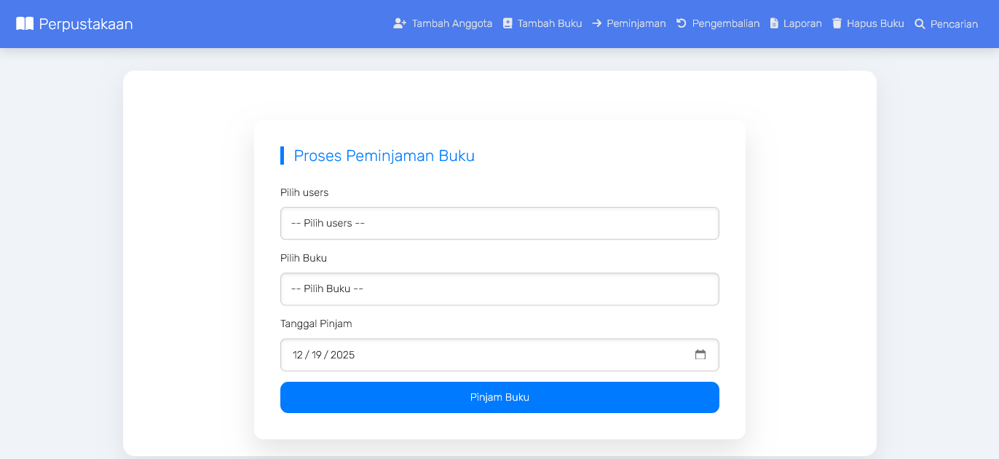
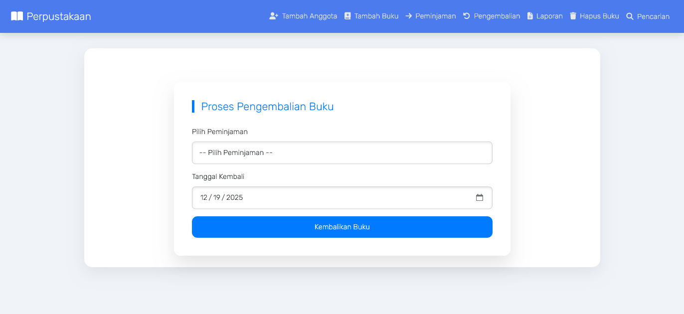
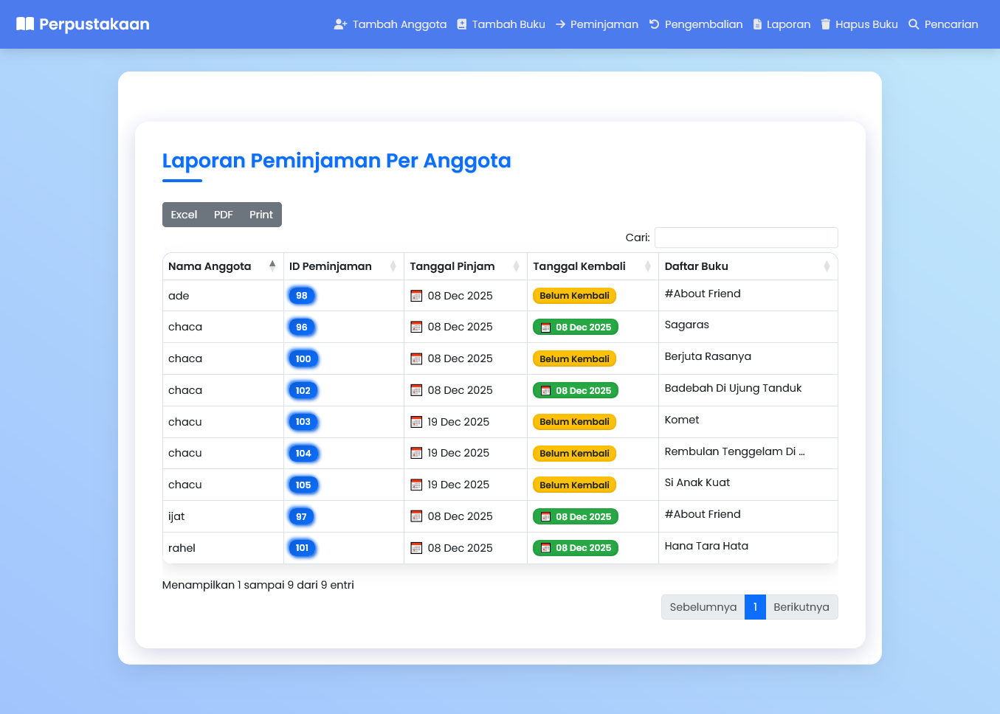
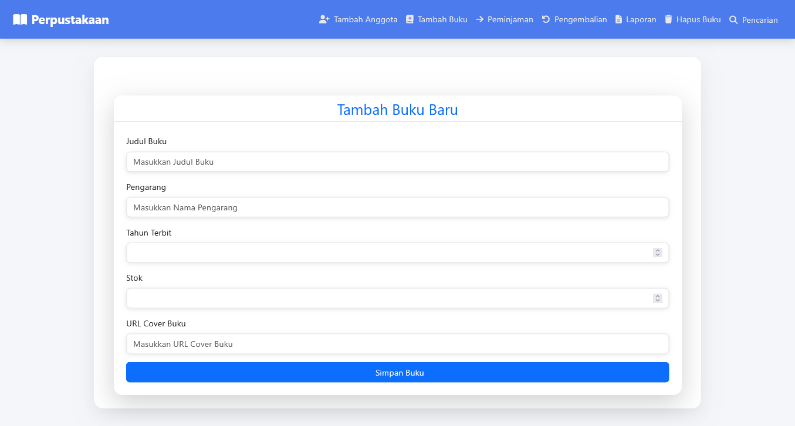
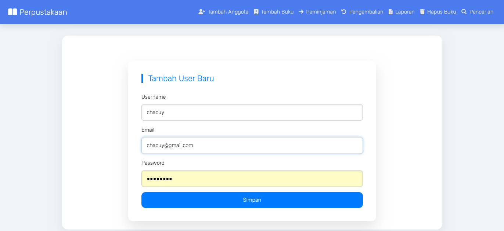

# 📚 Sistem Informasi Perpustakaan

Aplikasi web untuk mengelola **data buku**, **anggota**, serta **peminjaman & pengembalian buku** secara terstruktur dan efisien.  
Dirancang untuk kebutuhan **perpustakaan sekolah / kampus** dengan sistem **dua role (Admin & Anggota)**.

---

## 🖼️ Preview Aplikasi

| Tampilan |
|---------|
|  |
| **Dashboard Admin** – Menampilkan ringkasan stok buku, riwayat peminjaman, serta aktivitas terbaru di perpustakaan. |

---

## 📌 Deskripsi Proyek

**Sistem Informasi Perpustakaan** adalah aplikasi berbasis web yang membantu pengelolaan koleksi buku, data anggota, serta transaksi peminjaman dan pengembalian buku.  
Sistem ini mendukung **pengelolaan buku**, **manajemen anggota**, **peminjaman**, serta **laporan peminjaman** untuk mendukung operasional perpustakaan secara digital dan terstruktur.

---

## ✨ Fitur Utama

### 🔐 Sistem Autentikasi
- Login Anggota menggunakan akun terdaftar
- Registrasi akun untuk calon anggota
- Admin memiliki akses langsung ke sistem
- Pembatasan hak akses sesuai role

### 📊 Dashboard & Monitoring
- Dashboard Admin menampilkan stok buku dan riwayat peminjaman
- Dashboard Anggota menampilkan informasi buku dan status pinjaman
- Monitoring buku yang sedang dipinjam
- Informasi buku populer

### 📖 Manajemen Data Buku
- Tambah, edit, dan hapus data buku (Admin)
- Pencarian buku berdasarkan judul dan kategori
- Informasi stok buku
- Detail buku lengkap

### 🔄 Transaksi Perpustakaan
- Peminjaman buku oleh anggota
- My Book untuk melihat buku yang sedang dipinjam
- Pengembalian buku oleh admin
- Riwayat peminjaman anggota

### 📈 Laporan Peminjaman
- Laporan peminjaman buku
- Export PDF & Excel
- Arsip laporan perpustakaan

### 👥 Manajemen Anggota
- Tambah anggota baru
- Pengelolaan data anggota perpustakaan

---

## 🖼️ Tampilan Aplikasi

### 🔑 Autentikasi & Dashboard

| |
|--|
|  |
| **Login Anggota** – Digunakan anggota untuk masuk ke sistem menggunakan akun yang telah terdaftar. |

| |
|--|
|  |
| **Daftar Anggota** – Halaman pendaftaran akun baru agar calon anggota dapat melakukan peminjaman buku. |

| |
|--|
|  |
| **Dashboard Admin** – Menampilkan informasi utama seperti stok buku, data anggota, dan aktivitas peminjaman. |

---

### 📊 Dashboard Berdasarkan Role

| |
|--|
|  |
| **Dashboard Admin** – Admin memiliki akses penuh dalam pengelolaan buku, anggota, dan peminjaman. |

| |
|--|
|  |
| **Dashboard Anggota** – Menampilkan daftar buku dan status peminjaman pribadi anggota. |

---

### 📖 Data & Peminjaman Buku

| |
|--|
|  |
| **My Book** – Menampilkan daftar buku yang sedang dipinjam oleh anggota beserta tanggal pinjam dan pengembalian. |

| |
|--|
|  |
| **Pengembalian Buku** – Digunakan admin untuk memproses pengembalian buku dari anggota. |

| |
|--|
|  |
| **Peminjaman Buku** – Digunakan admin untuk mengelola transaksi peminjaman buku oleh anggota. |

---

### 📚 Manajemen Buku

| |
|--|
|  |
| **Hapus / Edit Buku** – Admin dapat mengedit dan menghapus data buku yang sudah tidak tersedia. |

| |
|--|
|  |
| **Tambah Buku** – Admin menambahkan buku baru dengan data judul, penulis, tahun terbit, dan stok. |

| |
|--|
|  |
| **Tambah Anggota** – Admin menambahkan dan mengelola data anggota perpustakaan. |

---

### 📈 Laporan & Riwayat

| |
|--|
|  |
| **Laporan Peminjaman** – Menampilkan laporan peminjaman buku yang dapat diekspor ke PDF dan Excel. |

| |
|--|
|  |
| **Riwayat Peminjaman** – Menampilkan seluruh riwayat peminjaman buku oleh anggota. |

---

## 👥 Role & Hak Akses

| Fitur | Admin | Anggota |
|------|-------|---------|
| Dashboard | ✅ Full Access | ✅ Limited |
| Data Buku | ✅ CRUD | 👁️ View |
| Peminjaman Buku | ✅ Kelola | ✅ Pinjam |
| Pengembalian Buku | ✅ Ya | ❌ Tidak |
| My Book | ❌ | ✅ Ya |
| Laporan | ✅ + Export | 👁️ View |
| Tambah Anggota | ✅ Ya | ❌ Tidak |

---

## 🛠️ Teknologi yang Digunakan

- **Frontend:** HTML5, CSS3, JavaScript
- **Backend:** PHP (Native / MVC)
- **Database:** MySQL
- **Export:** PDF & Excel
- **Session:** PHP Session Management

---

✨ *Dikembangkan sebagai sistem informasi perpustakaan yang sederhana, rapi, dan mudah digunakan.*
