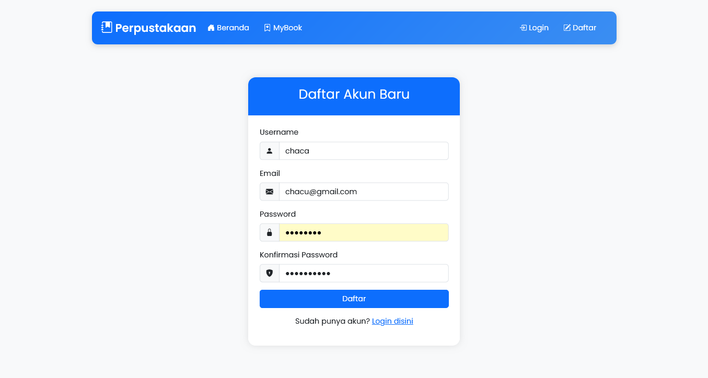
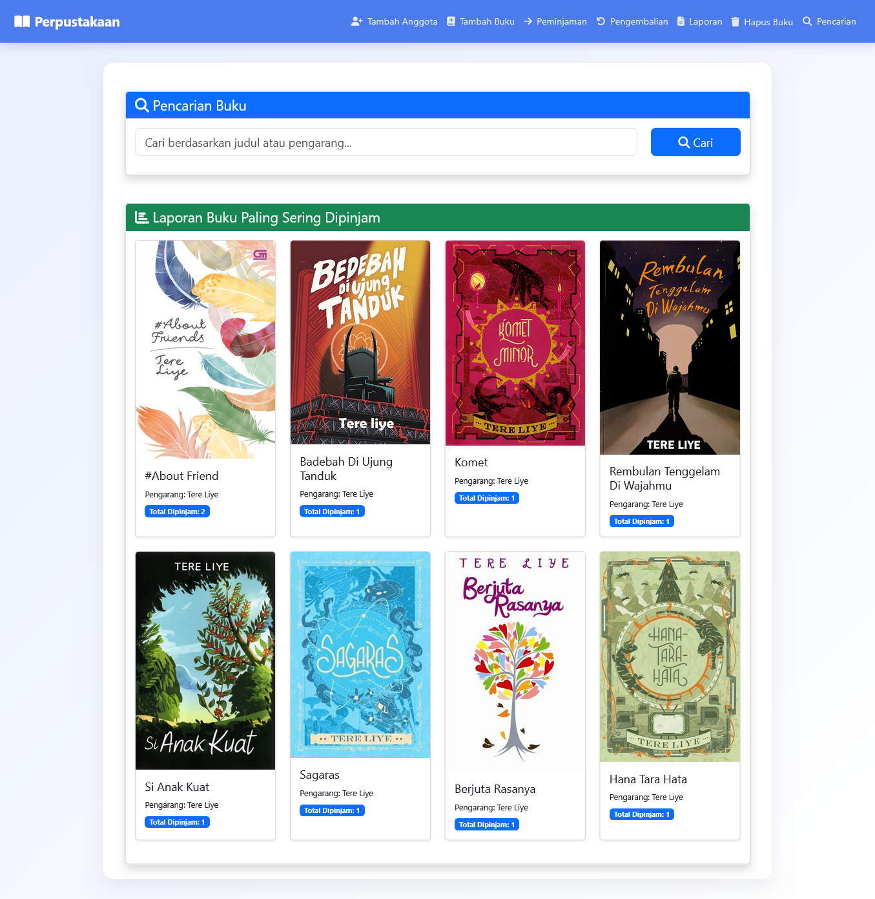

# 📚 Sistem Informasi Perpustakaan  
### Web-Based Library Management System

> Aplikasi web untuk mengelola **data buku**, **anggota**, serta **peminjaman & pengembalian buku** secara terstruktur dan efisien.  
> Dirancang untuk kebutuhan **perpustakaan sekolah / kampus** dengan sistem **dua role (Admin & Anggota)**.

---

## 🚀 Preview Aplikasi

  

  <b>Dashboard Admin</b> 
  Menampilkan ringkasan stok buku, jumlah anggota, riwayat peminjaman, serta aktivitas terbaru perpustakaan.

---

## 📌 Tentang Proyek

**Sistem Informasi Perpustakaan** merupakan aplikasi berbasis web yang bertujuan untuk membantu pengelolaan operasional perpustakaan secara digital.  
Aplikasi ini mencakup pengelolaan buku, data anggota, transaksi peminjaman dan pengembalian, serta pembuatan laporan peminjaman.

Sistem dirancang **sederhana, rapi, dan mudah digunakan**, baik oleh admin maupun anggota perpustakaan.

---

## ✨ Fitur Unggulan

### 🔐 Autentikasi & Akses
- Login khusus anggota perpustakaan
- Registrasi akun anggota baru
- Admin memiliki akses penuh tanpa registrasi
- Hak akses dibatasi berdasarkan role

### 📊 Dashboard & Monitoring
- Dashboard admin dengan informasi lengkap
- Dashboard anggota dengan informasi peminjaman pribadi
- Monitoring buku yang sedang dipinjam
- Informasi buku populer

### 📖 Manajemen Buku
- Tambah, edit, dan hapus data buku
- Pencarian buku berdasarkan judul
- Informasi stok buku tersedia
- Detail buku lengkap

### 🔄 Transaksi Perpustakaan
- Peminjaman buku oleh anggota
- My Book untuk memantau pinjaman
- Pengembalian buku oleh admin
- Riwayat peminjaman

### 📈 Laporan
- Laporan peminjaman buku
- Export PDF & Excel
- Arsip data perpustakaan

---

## 🖼️ Tampilan Aplikasi & Fungsinya

### 🔐 Login Anggota

  

**Fungsi:**
- Autentikasi akun anggota perpustakaan  
- Menjaga keamanan sistem  
- Mengarahkan anggota ke dashboard  

---

### 📝 Registrasi Anggota

  

**Fungsi:**
- Pendaftaran akun anggota baru  
- Menyimpan data anggota ke database  
- Memberikan akses peminjaman buku  

---

### 🧭 Dashboard Admin

  

**Fungsi:**
- Monitoring stok dan aktivitas perpustakaan  
- Akses cepat ke seluruh fitur admin  
- Ringkasan data buku & peminjaman  

---

### 👤 Dashboard Anggota

  

**Fungsi:**
- Melihat buku yang tersedia  
- Melihat status peminjaman pribadi  
- Akses ke fitur pencarian dan My Book  

---

### 🔍 Pencarian Buku

  

**Fungsi:**
- Mencari buku berdasarkan judul  
- Menampilkan ketersediaan buku  
- Mempermudah proses peminjaman  

---

### 📘 Peminjaman Buku

  

**Fungsi:**
- Mencatat transaksi peminjaman buku  
- Mengurangi stok secara otomatis  
- Menyimpan data tanggal peminjaman  

---

### 📖 My Book

  

**Fungsi:**
- Menampilkan daftar buku yang dipinjam  
- Menampilkan tanggal pinjam & pengembalian  
- Membantu anggota memantau pinjaman  

---

### 🔄 Pengembalian Buku

  

**Fungsi:**
- Memproses pengembalian buku  
- Mengembalikan stok buku  
- Menyelesaikan status peminjaman  

---

### 📚 Kelola Buku

  

**Fungsi:**
- Edit & hapus data buku  
- Menjaga keakuratan koleksi  
- Mengelola stok buku  

---

### ➕ Tambah Buku

  

**Fungsi:**
- Menambahkan buku baru  
- Menginput detail buku  
- Memperbarui koleksi perpustakaan  

---

### 👥 Kelola Anggota

  

**Fungsi:**
- Mengelola data anggota  
- Menambah anggota baru  
- Mendukung proses peminjaman  

---

### 📊 Laporan Peminjaman

  

**Fungsi:**
- Menampilkan laporan peminjaman  
- Rekap data perpustakaan  
- Export laporan ke PDF & Excel  

---

## 👥 Role & Hak Akses

| Fitur | Admin | Anggota |
|------|-------|---------|
| Dashboard | ✅ Full | ✅ Limited |
| Data Buku | ✅ CRUD | 👁️ View |
| Peminjaman | ✅ Kelola | ✅ Pinjam |
| Pengembalian | ✅ Ya | ❌ Tidak |
| My Book | ❌ | ✅ Ya |
| Laporan | ✅ Export | 👁️ View |
| Tambah Anggota | ✅ Ya | ❌ Tidak |

---

## 🛠️ Teknologi

- **Frontend:** HTML5, CSS3, JavaScript  
- **Backend:** PHP  
- **Database:** MySQL  
- **Export:** PDF & Excel  
- **Session:** PHP Session  

---

✨ *Dikembangkan sebagai sistem informasi perpustakaan yang modern, rapi, dan mudah digunakan.*
